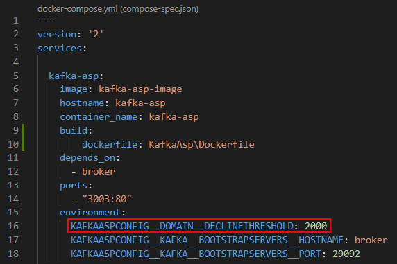
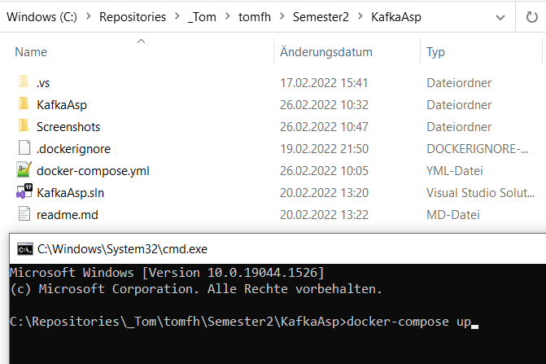
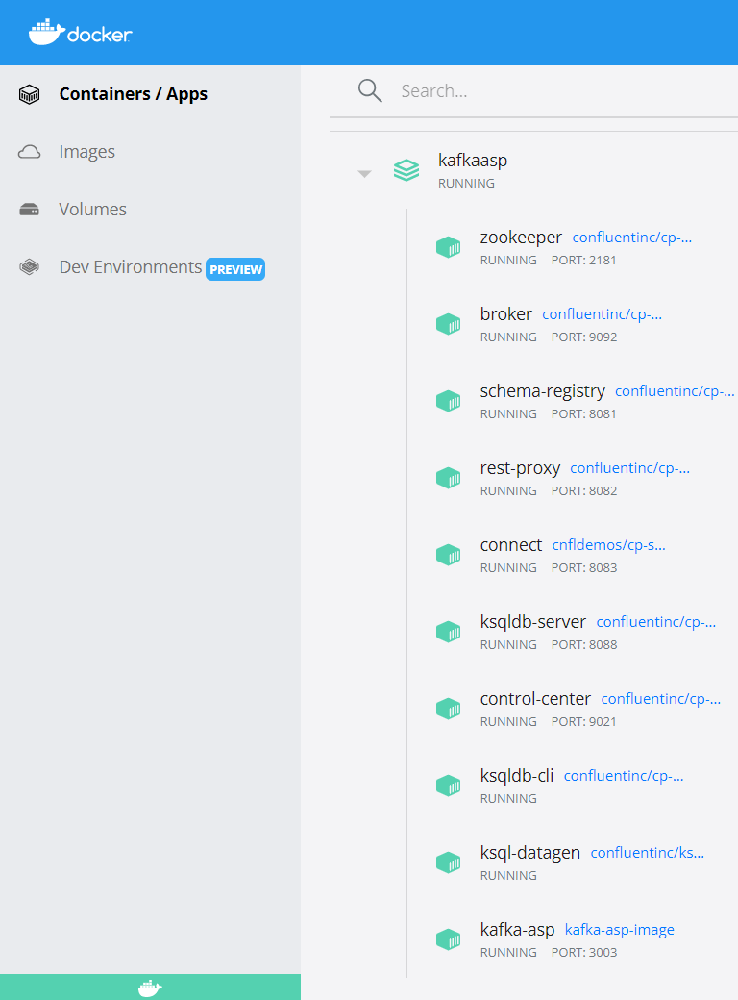
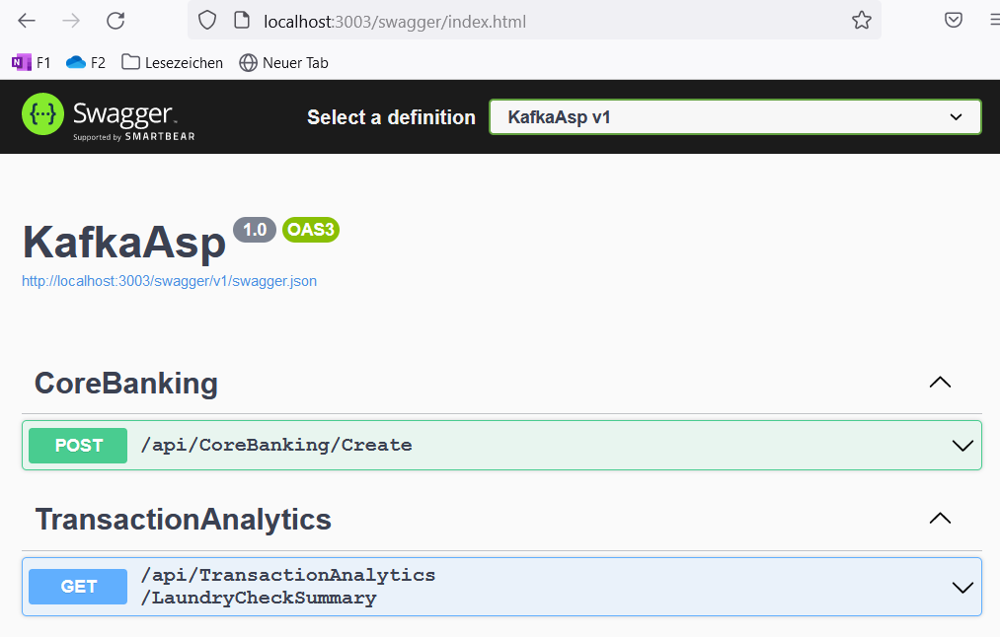
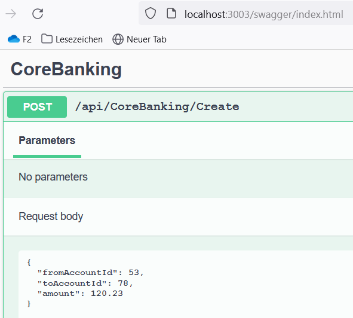
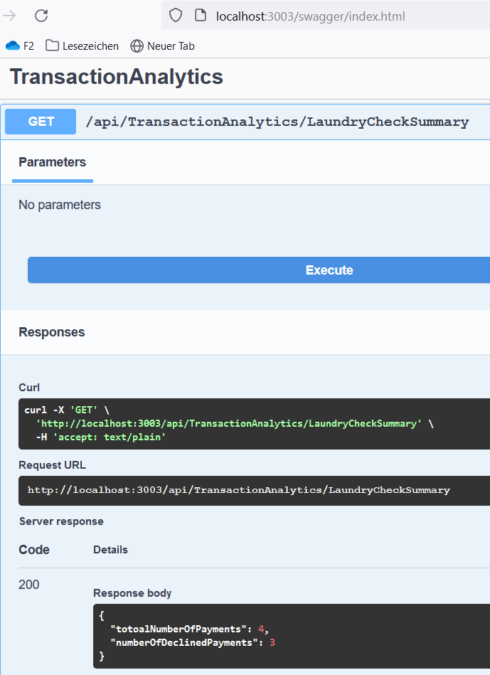
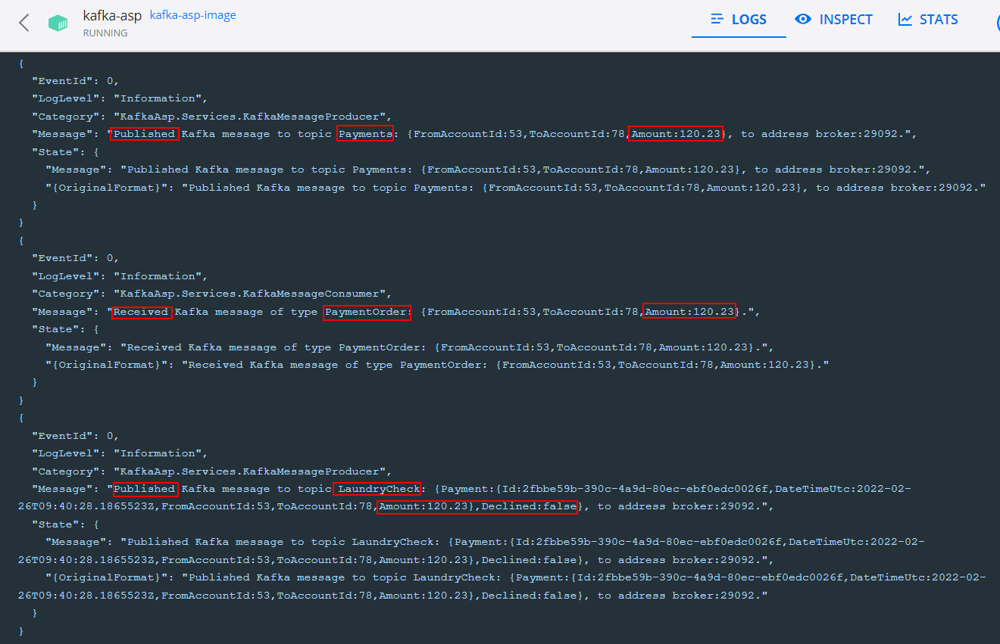
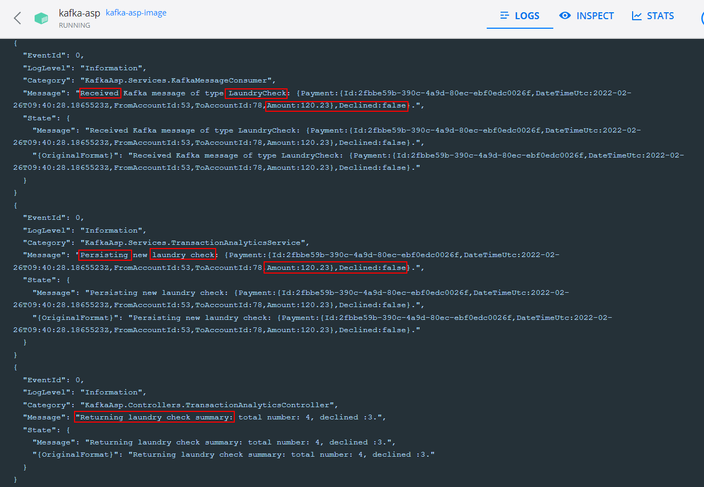

## Software Frameworks

## Assignment 1: Messaging (Kafka Demo)

## Author: se21m024

 
 

# Summary

This is a containerised ASP .NET 6 web API project to demonstrate a basic Kafka integration based on the requirements defined in https://moodle.technikum-wien.at/pluginfile.php/1418596/mod_resource/content/0/assigment.pdf.
 
 

# Repository

Clone the following repository:
 
https://github.com/se21m024/KafkaAsp
 
 
In the docker-compose.yml file the threshold for declining transactions can be configured. In this case all transactions with an amount of more than 2000 are declined.

 
 

# Run Project

Navigate to the root folder 'KafkaAsp' of the repository and execute the following command:
 
docker-compose up
 
 

 
 
The project is then built and started.

 
 

# Test Project

After the projet is started navigate to http://localhost:3003/swagger/index.html on your local browser to open the Swagger page of the project.

To create a new transation, post a transaction via http://localhost:3003/api/CoreBanking/Create.

To get a summary about how many transactions have been created and how many of them have been declined, call http://localhost:3003/api/TransactionAnalytics/LaundryCheckSummary.

The logs of the docker container 'kafka-asp' shows the flow of the messages.

